# Design Artifacts & Visual Specifications

## Voice-First AI Assistant for Field Service Operations

---

## Table of Contents

1. [Use Case Diagram](#1-use-case-diagram)
2. [High-Level Architecture Diagram](#2-high-level-architecture-diagram)
3. [System Component Diagram](#3-system-component-diagram)
4. [Deployment Architecture](#4-deployment-architecture)
5. [Entity Relationship Diagram (ERD)](#5-entity-relationship-diagram-erd)
6. [Sequence Diagram - Voice Query](#6-sequence-diagram---voice-query)
7. [Sequence Diagram - Create Inspection](#7-sequence-diagram---create-inspection)
8. [Sequence Diagram - Offline Sync](#8-sequence-diagram---offline-sync)
9. [Agent Architecture Diagram](#9-agent-architecture-diagram)
10. [Offline State Machine](#10-offline-state-machine)
11. [Authentication Flow](#11-authentication-flow)
12. [Technician Dashboard Wireframe](#12-technician-dashboard-wireframe)
13. [Supervisor Dashboard Wireframe](#13-supervisor-dashboard-wireframe)

---

## 1. Use Case Diagram

```mermaid
%%{init: {'theme': 'base', 'themeVariables': { 'primaryColor':'#ffffff', 'primaryTextColor':'#000000', 'primaryBorderColor':'#000000', 'lineColor':'#000000', 'textColor':'#000000', 'fontFamily': 'arial'}}}%%
graph TB
    subgraph System ["Voice-First AI Assistant System"]
        Query["Query Equipment<br/>History"]
        CreateInspection["Create Inspection<br/>Report"]
        CreateWO["Create Work<br/>Order"]
        UpdateWO["Update Work<br/>Order Status"]
        ViewDash["View<br/>Dashboard"]
        ViewAllAct["View All<br/>Activities"]
        OfflineRec["Offline<br/>Recording"]
        OfflineSync["Offline<br/>Sync Queue"]
        ViewAlerts["View &<br/>Acknowledge<br/>Alerts"]
    end
    
    Tech["👤 Technician"]
    Super["👤 Supervisor"]
    
    Tech -->|uses| Query
    Tech -->|uses| CreateInspection
    Tech -->|uses| CreateWO
    Tech -->|uses| UpdateWO
    Tech -->|uses| ViewDash
    Tech -->|uses| OfflineRec
    Tech -->|uses| OfflineSync
    
    Super -->|uses| ViewAllAct
    Super -->|uses| ViewAlerts
    Super -->|uses| ViewDash
    
    style System fill:#e1f5ff,stroke:#000000,stroke-width:2px,color:#000000
    style Tech fill:#fff3e0,stroke:#000000,stroke-width:2px,color:#000000
    style Super fill:#f3e5f5,stroke:#000000,stroke-width:2px,color:#000000
    style Query fill:#ffffff,stroke:#000000,color:#000000
    style CreateInspection fill:#ffffff,stroke:#000000,color:#000000
    style CreateWO fill:#ffffff,stroke:#000000,color:#000000
    style UpdateWO fill:#ffffff,stroke:#000000,color:#000000
    style ViewDash fill:#ffffff,stroke:#000000,color:#000000
    style ViewAllAct fill:#ffffff,stroke:#000000,color:#000000
    style OfflineRec fill:#ffffff,stroke:#000000,color:#000000
    style OfflineSync fill:#ffffff,stroke:#000000,color:#000000
    style ViewAlerts fill:#ffffff,stroke:#000000,color:#000000
```

**Key Use Cases:**
- **Query Equipment History**: Retrieve repair and maintenance records
- **Create Inspection Report**: Document field findings with severity levels
- **Create Work Order**: Generate maintenance tasks
- **Update Work Order**: Change status (OPEN → IN_PROGRESS → CLOSED)
- **View Dashboards**: Personal (Tech) or Company-wide (Supervisor)
- **Offline Recording**: Queue interactions when offline
- **View All Activities**: Supervisor monitoring and analytics

---

## 2. High-Level Architecture Diagram

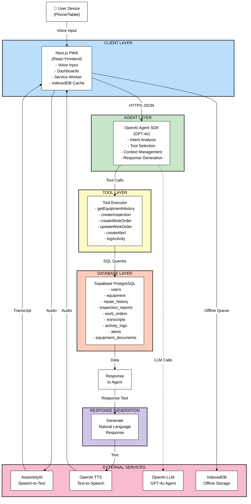

---

## 3. System Component Diagram

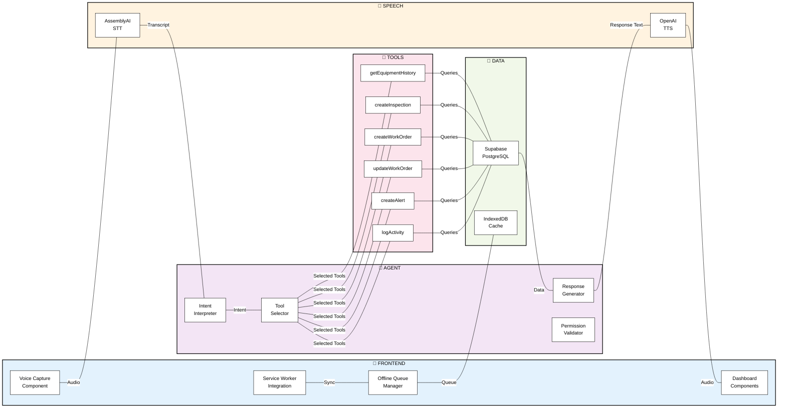

---

## 4. Deployment Architecture

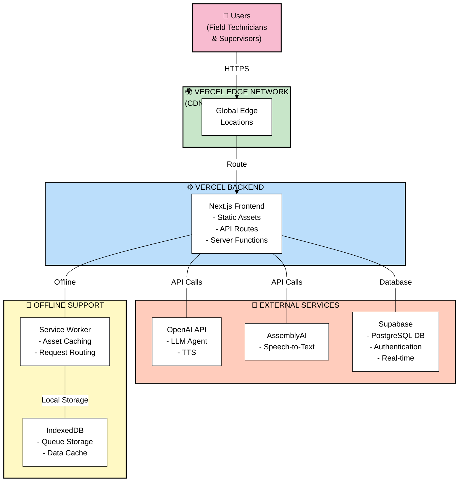

---

## 5. Entity Relationship Diagram (ERD)

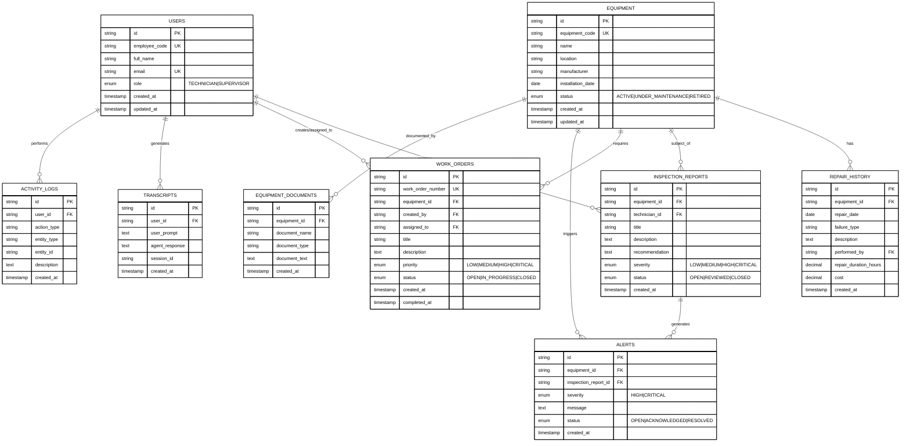

---

## 6. Sequence Diagram - Voice Query

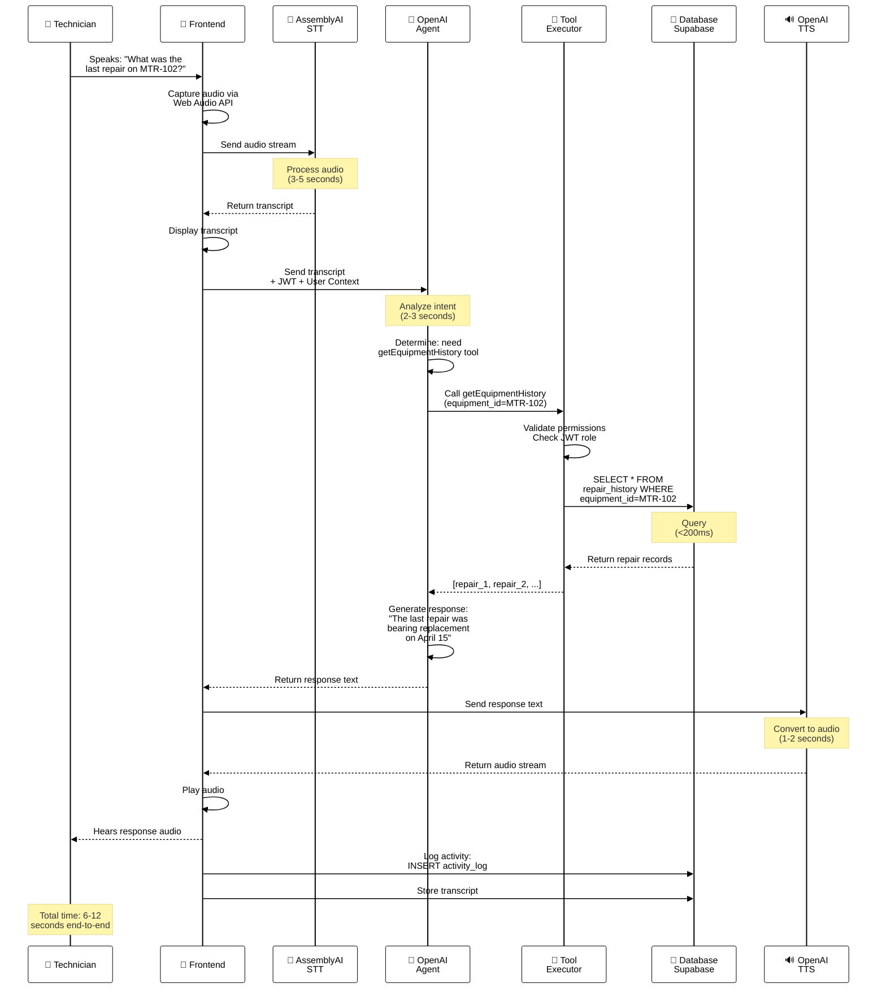

---

## 7. Sequence Diagram - Create Inspection

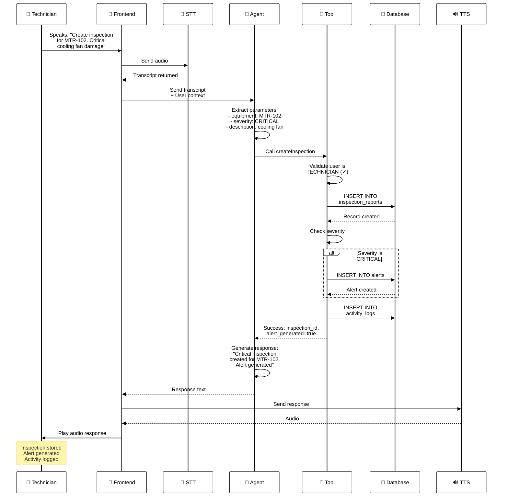

---

## 8. Sequence Diagram - Offline Sync

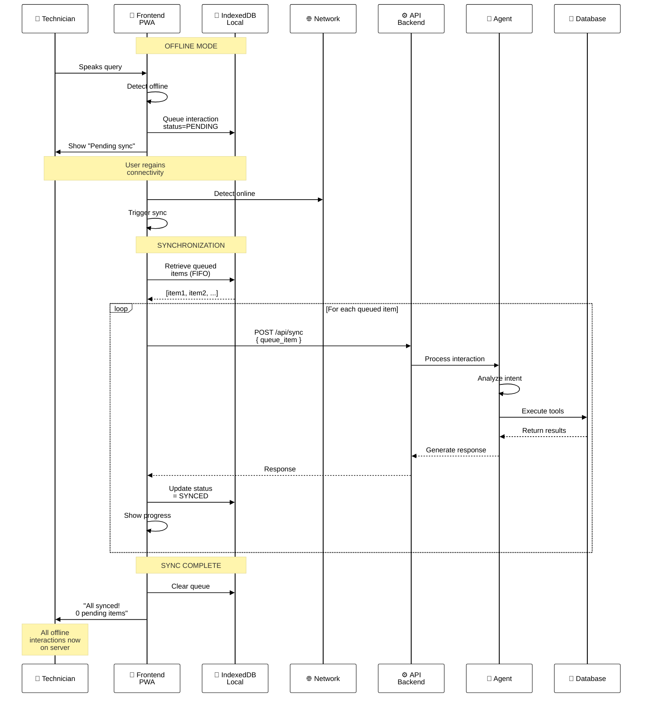

---

## 9. Agent Architecture Diagram

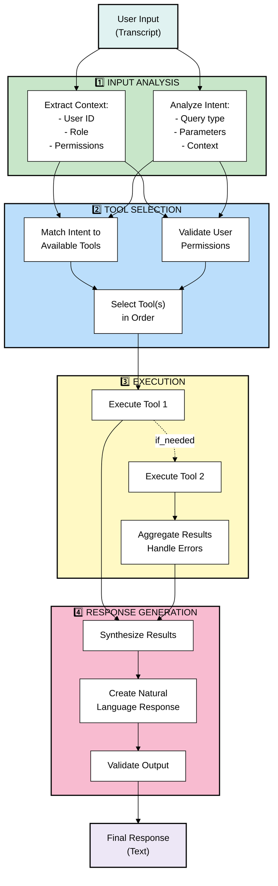

---

## 10. Offline State Machine

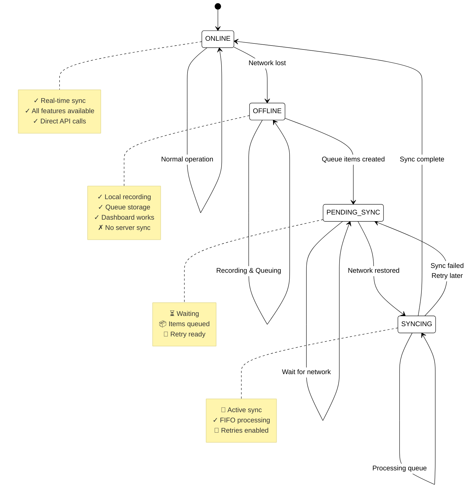

---

## 11. Authentication Flow

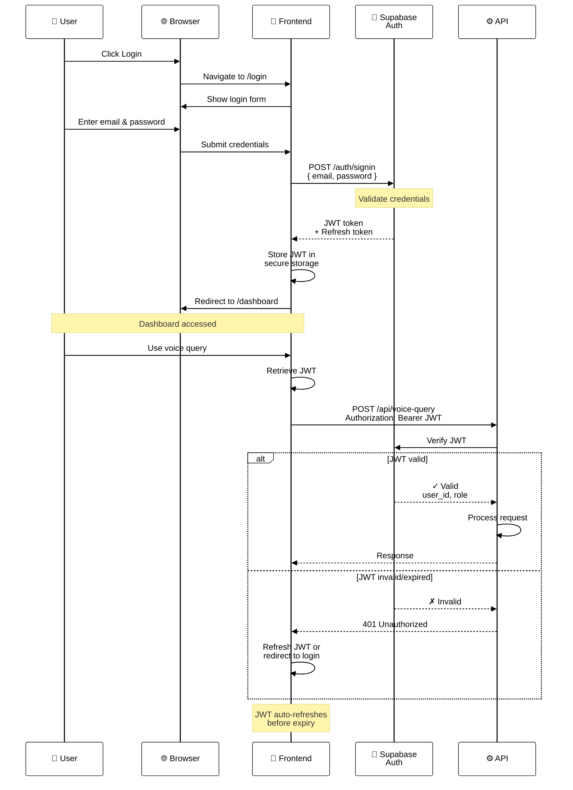

---

## 12. Technician Dashboard Wireframe

```
┌─────────────────────────────────────────────────────────────┐
│              TECHNICIAN DASHBOARD (Mobile)                  │
├─────────────────────────────────────────────────────────────┤
│                                                             │
│  [Profile] [⚙️ Settings] [●Online | 0 pending sync]        │
│  John Carter (TECH001)                                      │
│                                                             │
├─────────────────────────────────────────────────────────────┤
│                                                             │
│  ╔═══════════════════════════════════════════════════════╗ │
│  ║                                                       ║ │
│  ║            🎤 TAP TO SPEAK                           ║ │
│  ║                                                       ║ │
│  ║   (Large microphone button - glove-friendly)        ║ │
│  ║   Recording indicator when active                    ║ │
│  ║                                                       ║ │
│  ╚═══════════════════════════════════════════════════════╝ │
│                                                             │
│  TRANSCRIPT:                                                │
│  "Create an inspection for MTR-102, critical damage"       │
│                                                             │
│  AGENT RESPONSE (Playing):                                  │
│  "Critical inspection created for cooling pump..."         │
│  [⏸ Stop] [🔄 Replay]                                      │
│                                                             │
├─────────────────────────────────────────────────────────────┤
│ RECENT ACTIVITIES                                           │
├─────────────────────────────────────────────────────────────┤
│                                                             │
│ ▼ Equipment Query [10:45 AM]                                │
│   "What was the last repair on MTR-102?"                   │
│   → Bearing replacement - April 15, 2026                   │
│                                                             │
│ ▼ Inspection Created [10:30 AM]                             │
│   MTR-102: Cooling Pump - CRITICAL                         │
│   Cooling Fan Damage → Alert Generated                     │
│                                                             │
│ ▼ Work Order Created [10:15 AM]                             │
│   WO-1001: Replace cooling fan assembly - HIGH             │
│                                                             │
├─────────────────────────────────────────────────────────────┤
│ MY WORK ORDERS (3 open)                      [View All ⟶]  │
├─────────────────────────────────────────────────────────────┤
│                                                             │
│ [WO-1001] Replace cooling fan                              │
│ Equipment: MTR-102 | Priority: 🔴 HIGH | Status: OPEN    │
│ Assigned: Today, 10:30 AM | [Details] [Update Status]    │
│                                                             │
│ [WO-1002] Bearing maintenance                              │
│ Equipment: MTR-101 | Priority: 🟡 MEDIUM | Status: OPEN  │
│                                                             │
│ [WO-1003] Alignment check                                  │
│ Equipment: MTR-103 | Priority: 🟢 LOW | Status: OPEN     │
│                                                             │
├─────────────────────────────────────────────────────────────┤
│ MY INSPECTIONS (2 open)                      [View All ⟶]  │
├─────────────────────────────────────────────────────────────┤
│                                                             │
│ [⚠️ CRITICAL] Cooling Fan Wear                              │
│ Equipment: MTR-102 | Status: OPEN | Alert Generated ✓    │
│ Created: Today, 10:30 AM                                   │
│                                                             │
│ [⚠️ HIGH] Motor Temperature Elevated                         │
│ Equipment: MTR-104 | Status: OPEN                          │
│ Created: Today, 9:45 AM                                    │
│                                                             │
└─────────────────────────────────────────────────────────────┘
```

**Key Features:**
- Large microphone button optimized for field use (gloved hands)
- Real-time transcript display
- Voice response audio playback
- Recent activities feed
- Quick access to own work orders
- Inspection reports with severity indicators
- Offline sync status always visible
- Mobile-first, responsive design

---

## 13. Supervisor Dashboard Wireframe

```
┌──────────────────────────────────────────────────────────────────────┐
│                    SUPERVISOR DASHBOARD (Desktop)                   │
├──────────────────────────────────────────────────────────────────────┤
│                                                                      │
│ [Profile] [🔔 Notifications: 3] [Reports ▼] [⚙️ Settings]          │
│ Sarah Smith (SUPER001) | Last Activity: 2 minutes ago              │
│                                                                      │
├──────────────────────────────────────────────────────────────────────┤
│                                                                      │
│  ┌─────────────┬──────────────┬──────────────┬──────────────┐      │
│  │ 12 Open     │ 3 CRITICAL   │ 8 Tech       │ 2.5h Avg     │      │
│  │ Work Orders │ ALERTS [🔴]  │ Online       │ Response     │      │
│  │             │              │              │ Time         │      │
│  └─────────────┴──────────────┴──────────────┴──────────────┘      │
│                                                                      │
├──────────────────────┬─────────────────────────────────────────────┤
│ CRITICAL ALERTS (3)  │ ACTIVITY FEED                              │
├──────────────────────┼─────────────────────────────────────────────┤
│                      │                                             │
│ 🔴 [CRITICAL]        │ 10:45 John Carter                          │
│ Overheating          │ Equipment Query: MTR-102                   │
│ Equipment: MTR-102   │                                             │
│ Inspection: Cooling  │ 10:30 Sarah Smith                          │
│ Fan Damage           │ Created Inspection: CRITICAL               │
│ [Acknowledge]        │ MTR-102 - Cooling Fan                      │
│ [View Details]       │                                             │
│                      │ 10:15 Mike Johnson                         │
│ 🔴 [CRITICAL]        │ Created WO-1001                            │
│ Bearing Misalignment │ Equipment: MTR-102                         │
│ Equipment: MTR-104   │                                             │
│ [Acknowledge]        │ 10:00 John Carter                          │
│                      │ Updated WO-1003: IN_PROGRESS              │
│ 🟡 [HIGH]            │                                             │
│ Motor Temperature    │ 9:30 Sarah Smith                           │
│ Equipment: MTR-105   │ Created WO-1002                            │
│                      │ Equipment: MTR-101                         │
├──────────────────────┴─────────────────────────────────────────────┤
│ WORK ORDERS STATUS                                                 │
│ Filter: [All] [Open] [In Progress] [Closed] | Sort: [Priority]   │
├──────────────────────────────────────────────────────────────────────┤
│                                                                      │
│ WO-1001 │Replace cooling fan          │HIGH    │OPEN │John     │  │
│ WO-1002 │Bearing replacement          │CRITICAL│PROG │Sarah    │  │
│ WO-1003 │Alignment check             │MEDIUM  │OPEN │Mike     │  │
│ WO-1004 │Preventive maintenance      │LOW     │DONE │John     │  │
│ WO-1005 │Compressor service          │CRITICAL│OPEN │Sarah    │  │
│ WO-1006 │Motor coil inspection       │MEDIUM  │PROG │Mike     │  │
│                                                                      │
├──────────────────────────────────────────────────────────────────────┤
│ TECHNICIAN STATUS                                                    │
├──────────────────────────────────────────────────────────────────────┤
│                                                                      │
│ ● John Carter (TECH001)                                             │
│   Online | Last: 5m ago | Inspections: 2 | WO: 3 (1O, 2P)        │
│                                                                      │
│ ● Sarah Smith (TECH002)                                             │
│   Online | Last: 2m ago | Inspections: 3 | WO: 2 (1O, 1P)        │
│                                                                      │
│ ● Mike Johnson (TECH003)                                            │
│   Online | Last: 12m ago | Inspections: 1 | WO: 2 (All O)        │
│                                                                      │
│ ○ Lisa Rodriguez (TECH004)                                          │
│   Offline | Last: 45m ago | Inspections: 1 | Pending Sync: 2    │
│                                                                      │
├──────────────────────────────────────────────────────────────────────┤
│ RECENT TRANSCRIPTS                            │ INSPECTION REPORTS  │
│ [🔍 Search: ____________]                    │ [🔍 Search: ____] │
├──────────────────────────────────────────────┼──────────────────────┤
│                                              │                      │
│ "What was last repair MTR-102?"              │ [⚠️ CRITICAL] Cool. │
│ User: John | Time: 10:40 AM                  │ Equipment: MTR-102   │
│ Response: "Bearing replacement..."           │ Technician: Sarah    │
│                                              │ Created: Today       │
│ "Create WO for cooling fan"                  │ Recommendation:      │
│ User: Sarah | Time: 10:25 AM                 │ Replace assembly     │
│ Response: "WO-1001 created..."               │                      │
│                                              │ [⚠️ HIGH] Motor Temp │
│ "Show open work orders"                      │ Equipment: MTR-104    │
│ User: Mike | Time: 10:10 AM                  │ Technician: John     │
│ Response: "3 open WOs assigned..."           │ Created: Today       │
│                                              │ Recommendation:      │
│                                              │ Check cooling system │
│                                                                      │
└──────────────────────────────────────────────┴──────────────────────┘
```

**Key Features:**
- KPI cards at top (Open WOs, Alerts, Tech Status, Avg Response Time)
- Critical alerts prominently displayed
- Real-time activity feed
- Work orders with filtering/sorting
- Technician status monitoring (online/offline)
- Transcript QA for compliance
- Inspection tracking
- Responsive design for desktop/tablet

---

## Summary

This Design Artifacts document provides comprehensive visual specifications for the Voice-First AI Assistant system, including:

✅ **Use Case Diagram** - All major use cases and actor interactions  
✅ **Architecture Diagram** - Complete system layering  
✅ **Component Diagram** - How components interact  
✅ **Deployment Architecture** - Infrastructure and services  
✅ **Entity Relationship Diagram** - Complete database schema  
✅ **Sequence Diagrams** - Detailed interaction flows (3 scenarios)  
✅ **Agent Architecture** - AI processing pipeline  
✅ **Offline State Machine** - Offline/online transitions  
✅ **Authentication Flow** - Security and token management  
✅ **Technician Dashboard** - Mobile-first field interface  
✅ **Supervisor Dashboard** - Desktop operational oversight  

All diagrams are rendered using Mermaid syntax and can be displayed in any Markdown viewer that supports Mermaid (GitHub, GitLab, Notion, etc.).

---

**Generated**: June 12, 2026  
**Project**: Voice-First AI Assistant for Field Service Operations  
**Version**: 1.0
