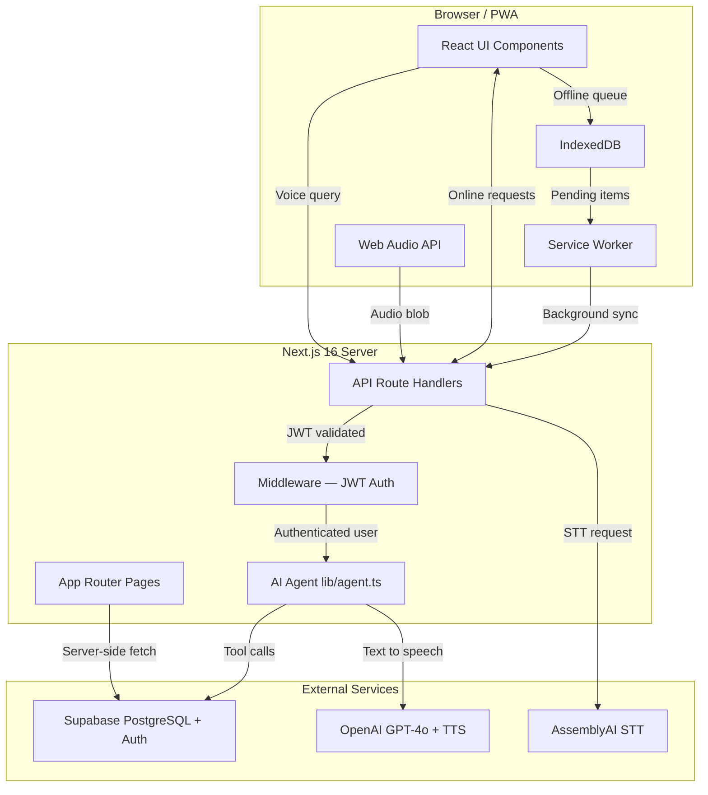
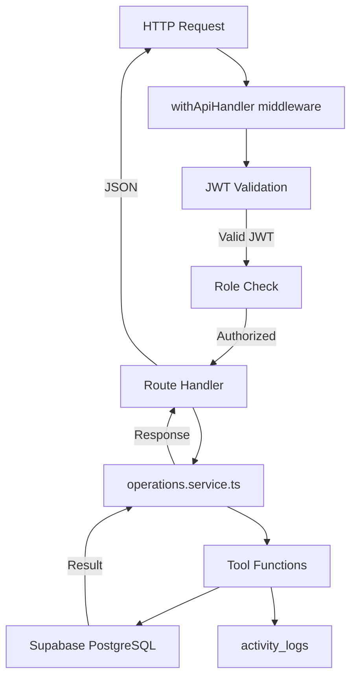
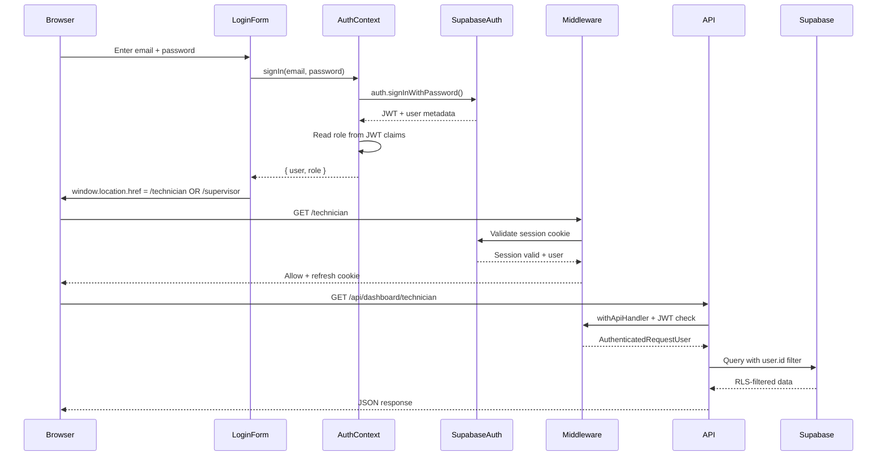
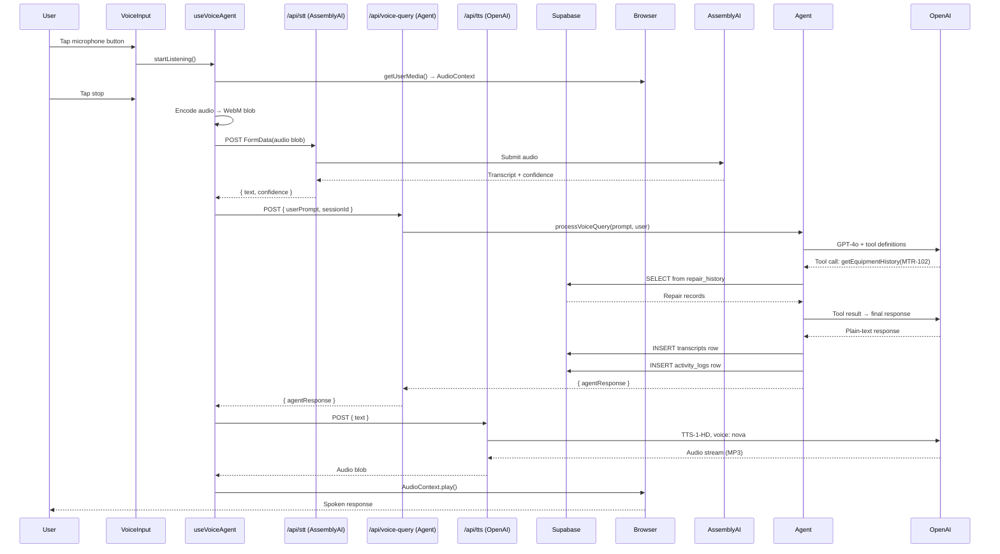
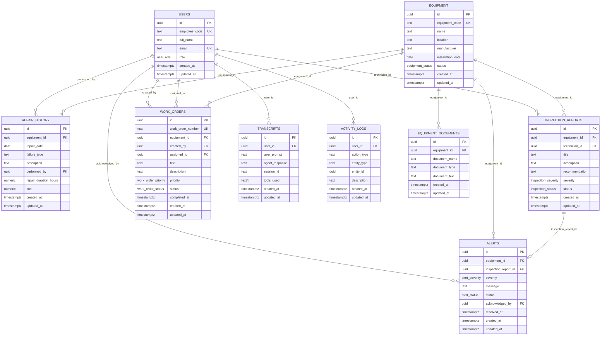
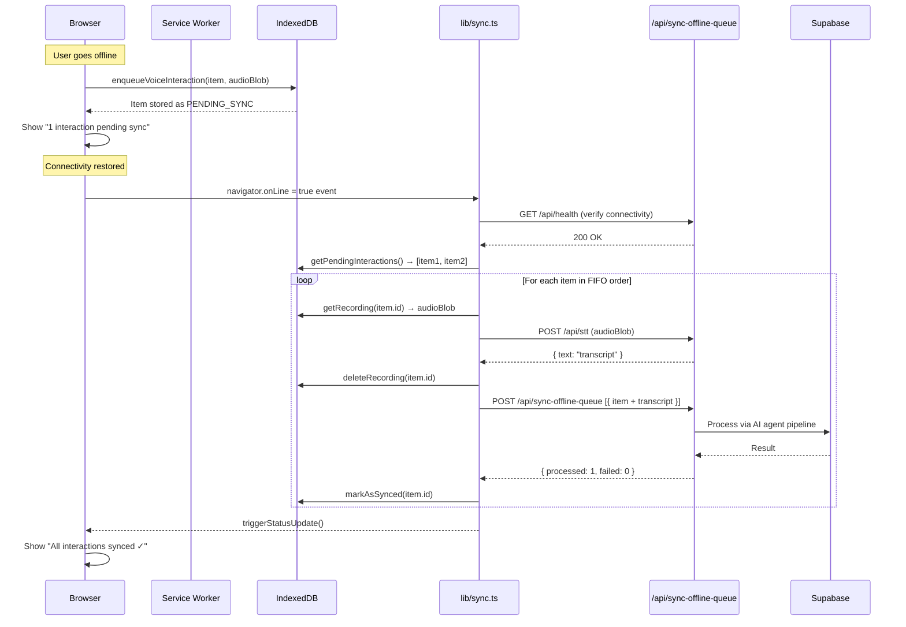

# VoxField — Complete Project Explanation

> **For new developers:** This document explains the entire VoxField system architecture, code structure, data flows, and implementation details. After reading this, you should be able to understand and contribute to any part of the system without reading the source code first.

---

## Table of Contents

1. [Project Overview](#1-project-overview)
2. [Technology Stack](#2-technology-stack)
3. [System Architecture](#3-system-architecture)
4. [Frontend Architecture](#4-frontend-architecture)
5. [Backend Architecture](#5-backend-architecture)
6. [Authentication Flow](#6-authentication-flow)
7. [Voice Query Flow](#7-voice-query-flow)
8. [Database — Tables & Relationships](#8-database--tables--relationships)
9. [Row Level Security (RLS)](#9-row-level-security-rls)
10. [Offline Sync — Deep Dive](#10-offline-sync--deep-dive)
11. [PWA Implementation](#11-pwa-implementation)
12. [API Reference](#12-api-reference)
13. [File-by-File Breakdown](#13-file-by-file-breakdown)
14. [Development Accounts](#14-development-accounts)
15. [Security Model](#15-security-model)

---

## 1. Project Overview

VoxField is a **Voice-First AI Assistant** for field service operations. Field technicians operate in demanding industrial environments where typing is inconvenient and hands are occupied. VoxField lets them interact with operational systems using natural spoken language.

### What Technicians Can Do by Voice

| Command | Example | What Happens |
|---------|---------|--------------|
| Query equipment history | "What was the last repair on MTR-102?" | AI agent fetches `repair_history` records and reads them back |
| Create inspections | "Create an inspection for PUMP-201. Seal is leaking. Critical." | AI creates `inspection_reports` row + auto-generates `alerts` row |
| Create work orders | "Create a work order for cooling fan replacement." | AI creates `work_orders` row with auto-generated WO-XXXX number |
| Update work orders | "Mark WO-2025-003 as in progress." | AI updates `work_orders.status` |
| Query own tasks | "Show my open work orders." | AI queries user's assigned work orders |

### What Supervisors Can Do

- View real-time activity feed of all technician actions
- Monitor critical alerts (CRITICAL/HIGH severity inspections)
- Manage work orders (table view with status tracking)
- Search voice transcripts (full-text audit trail)
- See technician online/offline status

---

## 2. Technology Stack

| Layer | Technology | Why |
|-------|-----------|-----|
| **Framework** | Next.js 16 (App Router) | SSR, API routes, file-based routing |
| **Language** | TypeScript | Type safety across full stack |
| **Styling** | Tailwind CSS | Utility-first, no runtime CSS |
| **Database** | Supabase PostgreSQL | Managed DB + Auth + RLS in one |
| **Auth** | Supabase Auth | JWT-based, SSO-ready, hooks for triggers |
| **AI Agent** | OpenAI GPT-4o | Function-calling for deterministic tool use |
| **STT** | AssemblyAI Universal-1 | Speech-to-Text with confidence scoring |
| **TTS** | OpenAI TTS-1-HD | Text-to-Speech, voice: nova |
| **Offline** | IndexedDB + Service Worker | Browser-native offline-first storage |
| **PWA** | Web App Manifest + Workbox | Installable, cacheable app shell |
| **Animation** | Framer Motion | Smooth micro-animations |

---

## 3. System Architecture



### Data Flow Summary

1. **Browser** captures audio via Web Audio API
2. Audio blob sent to `/api/stt` → AssemblyAI → transcript returned
3. Transcript sent to `/api/voice-query` → AI Agent (GPT-4o)
4. Agent uses function-calling to call tools (which hit Supabase)
5. Agent generates TTS-safe text response
6. Response sent to `/api/tts` → OpenAI TTS → audio stream
7. Audio played in browser
8. Transcript + response stored in `transcripts` table
9. Action logged in `activity_logs` table

---

## 4. Frontend Architecture

```mermaid
graph LR
    subgraph Layout["Layout Layer"]
        AL[AppLayout.tsx]
        OS[OfflineStatus.tsx]
    end

    subgraph Pages["Dashboard Pages"]
        TP[/technician page.tsx]
        SP[/supervisor page.tsx]
    end

    subgraph Components["Dashboard Components"]
        VI[VoiceInput.tsx]
        WOL[WorkOrdersList.tsx]
        IL[InspectionsList.tsx]
        AF[ActivityFeed.tsx]
        VH[VoiceHistory.tsx]
        OSS[OfflineSyncSection.tsx]
        KPI[KPICards.tsx]
        AL2[AlertsList.tsx]
        TL[TranscriptLog.tsx]
        WOK[WorkOrdersKanban.tsx]
    end

    subgraph Hooks["Custom Hooks"]
        HVA[useVoiceAgent.ts]
        HA[use-auth.ts]
    end

    subgraph Context["React Context"]
        AC[AuthContext.tsx]
    end

    AL --> TP
    AL --> SP
    TP --> VI
    TP --> WOL
    TP --> IL
    TP --> AF
    TP --> VH
    TP --> OSS
    SP --> KPI
    SP --> AL2
    SP --> TL
    SP --> WOK
    VI --> HVA
    HVA --> HA
    HA --> AC
```

### Key Design Decisions

**Server Components for Data Fetching**: Dashboard pages (`technician/page.tsx`, `supervisor/page.tsx`) are Next.js Server Components. They fetch data directly from Supabase on the server, eliminating client-side loading states for initial render.

**Client Components for Interactivity**: Voice input, offline status, and collapsible sidebar are `"use client"` components. They use browser APIs (Web Audio, IndexedDB, navigator.onLine).

**Separation of Data Sources**:
- `ActivityFeed` ← `activity_logs` table only
- `VoiceHistory` ← `transcripts` table only
- These are **never mixed**

---

## 5. Backend Architecture



### Service Layer — `operations.service.ts`

This is the heart of the backend. It contains:

| Function | Purpose |
|----------|---------|
| `getEquipmentHistory()` | Fetch repair history for equipment |
| `createInspection()` | Create inspection + auto-alert if CRITICAL |
| `createWorkOrder()` | Create work order with WO-XXXX number |
| `updateWorkOrder()` | Change work order status with forward-only validation |
| `createAlert()` | Internal helper, called automatically by createInspection |
| `logActivity()` | Immutable audit trail entry |
| `getTechnicianDashboard()` | Aggregated data for technician page |
| `getSupervisorDashboard()` | Aggregated data for supervisor page |
| `generateEquipmentSuggestions()` | DB-driven AI voice prompt suggestions |
| `processOfflineSyncQueue()` | Batch process queued offline items |

---

## 6. Authentication Flow



### How Role is Stored

Role is stored in Supabase Auth user metadata (`raw_user_meta_data.role`) and also in the `public.users` table. When a user signs in, a PostgreSQL trigger (`handle_new_user`) automatically creates the `public.users` row.

Custom JWT claims inject `role` into the JWT so middleware can read it without a DB query:

```sql
-- From 003_auth_triggers.sql
CREATE FUNCTION auth.custom_jwt_claims()
RETURNS jsonb AS $$
  SELECT jsonb_build_object('role', raw_user_meta_data->>'role')
  FROM auth.users WHERE id = auth.uid()
$$ LANGUAGE sql STABLE;
```

### Session Persistence

Supabase uses HTTP-only cookies for session storage in SSR mode. The `@supabase/ssr` package handles cookie read/write in both Server Components and API routes. Sessions auto-refresh before expiry via `supabase/middleware.ts`.

---

## 7. Voice Query Flow



### Offline Voice Handling

If the user is offline when they tap the microphone:
1. Recording proceeds normally (audio captured locally)
2. On stop, audio blob is stored in IndexedDB `voice_recordings` store
3. A `QueueItem` is inserted in `offline_queue` with `operation: "voice-query"`
4. User sees verbal/visual feedback: "Recording saved. Will sync when online."
5. On reconnection, `sync.ts` picks up the queue item, POSTs audio to `/api/stt`, then proceeds normally

---

## 8. Database — Tables & Relationships



### Enum Types

| Type | Values |
|------|--------|
| `user_role` | `TECHNICIAN`, `SUPERVISOR` |
| `equipment_status` | `ACTIVE`, `UNDER_MAINTENANCE`, `RETIRED` |
| `inspection_severity` | `LOW`, `MEDIUM`, `HIGH`, `CRITICAL` |
| `inspection_status` | `OPEN`, `REVIEWED`, `CLOSED` |
| `work_order_priority` | `LOW`, `MEDIUM`, `HIGH`, `CRITICAL` |
| `work_order_status` | `OPEN`, `IN_PROGRESS`, `CLOSED` |
| `alert_severity` | `HIGH`, `CRITICAL` |
| `alert_status` | `OPEN`, `ACKNOWLEDGED`, `RESOLVED` |

---

## 9. Row Level Security (RLS)

RLS is PostgreSQL's built-in access control at the row level. All sensitive tables have RLS enabled. Users can only see their own data unless they are a SUPERVISOR.

### Authorization Matrix

| Table | TECHNICIAN | SUPERVISOR |
|-------|-----------|-----------|
| `users` | SELECT own row | SELECT all rows |
| `equipment` | SELECT all | SELECT + INSERT + UPDATE |
| `repair_history` | SELECT all | SELECT all |
| `inspection_reports` | SELECT/INSERT own | SELECT all |
| `work_orders` | SELECT own, UPDATE status | SELECT/INSERT/UPDATE all |
| `transcripts` | SELECT/INSERT own | SELECT all |
| `activity_logs` | SELECT own, INSERT | SELECT all, no UPDATE/DELETE |
| `alerts` | SELECT all | SELECT/UPDATE all |

### How RLS Works in This Project

```sql
-- Example: Technicians can only see their own inspections
CREATE POLICY "technician_own_inspections_select"
  ON inspection_reports FOR SELECT
  USING (
    technician_id = auth.uid()
    OR (auth.jwt() ->> 'role') = 'SUPERVISOR'
  );
```

The `auth.jwt() ->> 'role'` reads the custom role claim injected into the JWT by the `auth.custom_jwt_claims()` function.

---

## 10. Offline Sync — Deep Dive

This is the most complex part of the system. Here is a complete explanation from first principles.

### What is a PWA?

A **Progressive Web App (PWA)** is a website that can be installed on a device like a native app and work offline. VoxField is a PWA, meaning technicians can install it on their phone and use it even without internet.

### What is IndexedDB?

**IndexedDB** is a browser-native NoSQL database built into every modern browser. It can store:
- Strings and numbers
- JavaScript objects
- Binary blobs (like audio recordings)
- Arrays

Data in IndexedDB **persists across browser restarts**. It is not cleared when the tab closes. This makes it ideal for storing offline work that needs to sync later.

VoxField uses IndexedDB for:
- `offline_queue` — Pending voice interactions to sync
- `voice_recordings` — Raw audio blobs for offline recordings
- `sync_metadata` — Last sync time, sync state
- `user_cache` — Cached API responses for offline reading

### What is Offline-First Architecture?

Offline-first means: **design for offline first, treat connectivity as an enhancement**.

Traditional apps: Write to server → cache locally (online-first)
Offline-first: Write to local storage → sync to server when possible (offline-first)

VoxField's offline strategy:
1. When online: requests go directly to the server API
2. When offline: requests are saved to IndexedDB
3. On reconnection: saved items are processed through the normal server pipeline

### Queue Item Schema

```typescript
interface QueueItem {
  id: string;              // UUID — prevents duplicate processing
  operation: "voice-query" | "create-inspection" | "create-work-order" | "update-work-order";
  payload: Record<string, any>; // Operation-specific data
  queuedAt: string;        // ISO timestamp — FIFO ordering
  status: "PENDING_SYNC" | "SYNCING" | "SYNCED" | "FAILED";
  attempt_count: number;   // Incremented on each retry
  session_id: string;      // Groups related interactions
  error?: string;          // Last error message if FAILED
}
```

### Offline Sync Flow



### Retry Logic

Failed items are retried with exponential backoff:

| Attempt | Delay |
|---------|-------|
| 1st | Immediate |
| 2nd | 1 second |
| 3rd | 5 seconds |
| 4+ | Manual retry required |

After 3 failed attempts, items are marked `FAILED` and require a manual "Retry" button press.

### Idempotency

Every queue item has a UUID (`id`). The server uses `ON CONFLICT (id) DO NOTHING` on all inserts. This means if a sync item is accidentally processed twice (network error after server commit), the duplicate is silently ignored — **no duplicate data**.

### Files Implementing Offline Sync

| File | Role |
|------|------|
| `src/lib/indexeddb.ts` | IndexedDB CRUD operations |
| `src/lib/sync.ts` | Sync orchestration, retry logic, network detection |
| `src/components/dashboard/OfflineSyncSection.tsx` | Dashboard section showing sync status |
| `src/components/dashboard/OfflineStatus.tsx` | Header indicator (compact) |
| `public/sw.js` | Service Worker — caching + background sync |
| `src/components/voice/ServiceWorkerRegister.tsx` | SW registration in browser |
| `src/app/api/sync-offline-queue/route.ts` | Server-side sync endpoint |

---

## 11. PWA Implementation

### Web App Manifest

`public/manifest.json` defines how the app appears when installed:

```json
{
  "name": "VoxField",
  "short_name": "VoxField",
  "description": "Voice-First AI Assistant for Field Service",
  "display": "standalone",
  "background_color": "#1C1A17",
  "theme_color": "#D14923",
  "start_url": "/technician",
  "icons": [...]
}
```

### Service Worker Strategies

`public/sw.js` uses different caching strategies for different resource types:

| Resource | Strategy | Why |
|----------|----------|-----|
| HTML pages | NetworkFirst | Always get fresh content |
| JS/CSS chunks | NetworkFirst | Prevent stale module errors |
| `/api/health` | NetworkOnly | Always real connectivity check |
| Images/fonts | CacheFirst | Rarely change, fast loading |

> **Important**: Service Worker is disabled in development (`NODE_ENV !== 'production'`) to prevent interference with Next.js HMR (Hot Module Replacement).

---

## 12. API Reference

### Authentication

All endpoints (except `/api/health`) require a valid Supabase JWT in the cookie (set by Supabase Auth SSR). The `withApiHandler` middleware validates this on every request.

### Endpoint List

| Method | Path | Role Required | Description |
|--------|------|--------------|-------------|
| `GET` | `/api/health` | None | Connectivity check |
| `POST` | `/api/stt` | Any | Speech-to-text via AssemblyAI |
| `POST` | `/api/tts` | Any | Text-to-speech via OpenAI |
| `POST` | `/api/voice-query` | Any | AI agent query pipeline |
| `POST` | `/api/inspections/create` | TECHNICIAN | Create inspection report |
| `POST` | `/api/work-orders/create` | TECHNICIAN | Create work order |
| `PATCH` | `/api/work-orders/[id]` | TECHNICIAN | Update work order status |
| `GET` | `/api/equipment/[id]/history` | Any | Get repair history for equipment |
| `POST` | `/api/sync-offline-queue` | Any | Batch sync queued offline items |
| `GET` | `/api/dashboard/technician` | TECHNICIAN | Technician dashboard data |
| `GET` | `/api/dashboard/supervisor` | SUPERVISOR | Supervisor dashboard data |

### Standard Response Format

**Success:**
```json
{
  "data": { "..." },
  "status": "success",
  "timestamp": "2025-06-15T17:00:00Z"
}
```

**Error:**
```json
{
  "error": "Description of what went wrong",
  "code": "UNAUTHORIZED",
  "timestamp": "2025-06-15T17:00:00Z"
}
```

### Error Codes

| Code | HTTP Status | Meaning |
|------|------------|---------|
| `UNAUTHORIZED` | 401 | Missing or expired JWT |
| `FORBIDDEN` | 403 | Wrong role for this endpoint |
| `NOT_FOUND` | 404 | Resource doesn't exist |
| `INVALID_INPUT` | 400 | Validation failed |
| `CONFLICT` | 409 | Unique constraint violated |
| `AGENT_ERROR` | 500 | AI agent failed |

---

## 13. File-by-File Breakdown

### `src/app/`

| File/Dir | Purpose |
|----------|---------|
| `layout.tsx` | Root HTML shell, providers, manifest link |
| `page.tsx` | Root redirect to `/login` |
| `providers.tsx` | Wraps app in `AuthProvider` |
| `globals.css` | Base Tailwind imports |
| `(auth)/login/page.tsx` | Login page (email/password) |
| `(dashboard)/layout.tsx` | Shared dashboard layout — auth check + AppLayout |
| `(dashboard)/technician/page.tsx` | **Technician dashboard** — Server Component, fetches all dashboard data |
| `(dashboard)/supervisor/page.tsx` | **Supervisor dashboard** — Server Component |

### `src/app/api/`

| Dir | Handler | Purpose |
|-----|---------|---------|
| `health/route.ts` | GET | Simple 200 OK for connectivity ping |
| `stt/route.ts` | POST | AssemblyAI speech-to-text |
| `tts/route.ts` | POST | OpenAI TTS-1-HD audio synthesis |
| `voice-query/route.ts` | POST | Main AI agent pipeline |
| `inspections/create/route.ts` | POST | Create inspection report |
| `work-orders/create/route.ts` | POST | Create work order |
| `work-orders/[id]/route.ts` | PATCH | Update work order status |
| `equipment/[id]/history/route.ts` | GET | Equipment repair history |
| `sync-offline-queue/route.ts` | POST | Process offline queue batch |
| `dashboard/technician/route.ts` | GET | Technician dashboard data |
| `dashboard/supervisor/route.ts` | GET | Supervisor dashboard data |

### `src/components/`

#### `layout/`

| File | Purpose |
|------|---------|
| `AppLayout.tsx` | Main app chrome: collapsible sidebar (desktop), mobile drawer, page header |

#### `voice/`

| File | Purpose |
|------|---------|
| `VoiceInput.tsx` | Microphone button, waveform, transcript display, dynamic DB-driven suggestion chips |
| `ServiceWorkerRegister.tsx` | Registers SW in browser (disabled in dev) |

#### `dashboard/`

| File | Data Source | Purpose |
|------|-------------|---------|
| `ActivityFeed.tsx` | `activity_logs` | Recent technician actions feed |
| `VoiceHistory.tsx` | `transcripts` | Voice interaction history (User ↔ AI conversations) |
| `OfflineSyncSection.tsx` | IndexedDB | Dedicated offline sync status card |
| `OfflineStatus.tsx` | IndexedDB | Compact header sync indicator |
| `WorkOrdersList.tsx` | `work_orders` | Technician's work orders list |
| `InspectionsList.tsx` | `inspection_reports` | Technician's inspection list |
| `KPICards.tsx` | Supervisor dashboard data | Summary metric cards |
| `AlertsList.tsx` | `alerts` | CRITICAL/HIGH alerts with acknowledge |
| `TranscriptLog.tsx` | `transcripts` | Supervisor searchable transcript log |
| `WorkOrdersKanban.tsx` | `work_orders` | Kanban board for supervisor |
| `FormattedDate.tsx` | — | Client-side date formatter (avoids hydration mismatch) |

### `src/services/`

| File | Purpose |
|------|---------|
| `operations.service.ts` | **Core service layer.** All database operations, dashboard data aggregation, equipment suggestion generation |
| `auth.service.ts` | Supabase Auth signIn/signOut/signUp wrappers |

### `src/lib/`

| File | Purpose |
|------|---------|
| `indexeddb.ts` | IndexedDB CRUD: enqueue, get pending, mark synced/failed |
| `sync.ts` | Sync engine: network detection, FIFO processing, retry backoff |
| `agent.ts` | OpenAI GPT-4o integration, tool definitions, processVoiceQuery |
| `api/middleware.ts` | `requireAuth()`, `requireRole()`, `withApiHandler()` |
| `api/handler.ts` | `withApiHandler` wrapper — auth + error handling for all routes |
| `api/response.ts` | `apiSuccess()`, `apiError()` — standardized response helpers |
| `supabase/client.ts` | Browser Supabase client |
| `supabase/server.ts` | Server-side Supabase client (reads cookies) |
| `supabase/middleware.ts` | Refreshes Supabase session on every request |

### `src/hooks/`

| File | Purpose |
|------|---------|
| `useVoiceAgent.ts` | Full voice pipeline: microphone → STT → agent → TTS → playback |
| `use-auth.ts` | Auth hook that reads from AuthContext |

### `src/context/`

| File | Purpose |
|------|---------|
| `AuthContext.tsx` | Global auth state: user, role, isLoading, signIn, signOut |

### `src/types/`

| File | Purpose |
|------|---------|
| `database.ts` | TypeScript types for all Supabase tables and enums |

### `supabase/`

| File | Purpose |
|------|---------|
| `001_initial_schema.sql` | Base tables, enums, indexes |
| `002_rls_policies.sql` | Row Level Security policies |
| `003_auth_triggers.sql` | Auto-create users profile on auth signup + custom JWT claims |
| `004_security_hardening.sql` | Tightened RLS policies |
| `seed.sql` | Basic seed data |
| `seed_dev.sql` | **Development seed** — 6 equipment, 11 repairs, 5 inspections, 5 WOs, 12 logs, 11 transcripts + dev accounts |

### `public/`

| File | Purpose |
|------|---------|
| `sw.js` | Service Worker (Workbox-based, disabled in dev) |
| `manifest.json` | PWA manifest |

---

## 14. Development Accounts

> [!CAUTION]
> **Development use only.** These accounts exist only to populate the dashboard with realistic data during development. Do NOT use in production.

| Role | Email | Password |
|------|-------|---------|
| Technician | `technician@gmail.com` | `tech123` |
| Supervisor | `supervisor@gmail.com` | `sup123` |

### Setting Up Dev Data

1. Start the Next.js dev server (`npm run dev`) and navigate to `http://localhost:3000/login`.
2. Select the **Sign Up** tab.
3. Create a **Technician** account using email: `technician@gmail.com` and password `tech123`.
4. Create a **Supervisor** account using email: `supervisor@gmail.com` and password `sup123`.
5. Open your Supabase Dashboard → SQL Editor and execute the `supabase/seed_dev.sql` script to populate and link the application data.
6. Verify the inserts using the queries at the bottom of the sql script.
7. Log in at `http://localhost:3000/login` using the newly created accounts.

### What Dev Data Includes

- **6 industrial equipment** items: MTR-102, PUMP-201, COMP-001, GEN-B2, HVAC-F3, CHI-001
- **11 repair history records** across equipment
- **5 inspection reports** (LOW, MEDIUM, HIGH, CRITICAL severities)
- **5 work orders** (various priorities and statuses)
- **3 alerts** (CRITICAL PUMP seal, HIGH HVAC temp, HIGH MTR belt)
- **12 activity log** entries
- **11 voice transcript** entries (full User ↔ AI conversations)

---

## 15. Security Model

### Layers of Security

```
1. HTTPS (TLS 1.3+) — All traffic encrypted
2. Supabase Auth JWT — Identity verification
3. Next.js Middleware — Route protection (redirect unauthenticated users)
4. withApiHandler — JWT validation on every API route
5. requireRole() — Role enforcement (TECHNICIAN vs SUPERVISOR)
6. PostgreSQL RLS — Database-level row filtering
7. Parameterised queries — SQL injection prevention
8. Environment variables — No secrets in source code
```

### JWT Flow

1. User logs in → Supabase issues JWT (1-hour expiry)
2. JWT stored in HTTP-only cookie (not accessible to JavaScript)
3. On each request, middleware calls `supabase.auth.getUser()` to validate
4. 5-minute interval auto-refresh keeps session alive
5. On sign-out, cookies cleared → any cached JWT is invalidated server-side

### Role Enforcement (Defence in Depth)

Role is checked at **three independent layers**:
1. **Frontend routing**: AuthContext redirects wrong-role users away
2. **API middleware**: `requireRole(user, ["TECHNICIAN"])` throws 403 if wrong role
3. **Database RLS**: Even if API check fails, DB only returns rows the role is allowed to see

This means there is no single point of failure in access control.

### What the AI Agent Can and Cannot Do

The agent is constrained by:
- **Tool list**: Only tools defined in `lib/agent.ts` are available
- **Role injection**: System prompt includes the user's role and approved tool list
- **Temperature 0.2**: Deterministic tool selection, minimal hallucination
- **Read-only SQL mode**: Dynamic SQL queries are SELECT-only (no mutations)
- **Approved tables only**: Dynamic queries limited to `equipment`, `repair_history`, `work_orders`, `inspection_reports`

---

*Last updated: June 2026 | VoxField v1.0*
