# VoxField API Flows

## Overview

VoxField exposes a collection of Next.js API Routes that act as the communication layer between the frontend, AI agent, business logic layer, and Supabase database.

The API layer follows a consistent pattern:


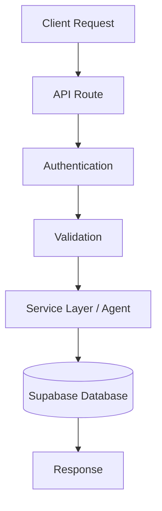

Most routes use the shared API infrastructure:

```text
withApiHandler()
parseJsonBody()
apiSuccess()
```

This ensures consistent authentication, error handling, and response formatting.

---

# API Architecture

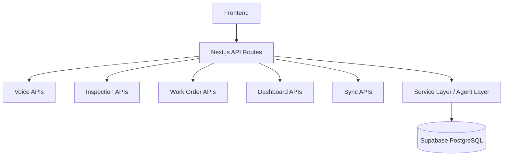

---

# Voice Query Flow

## Endpoint

```text
POST /api/voice-query
```

## Purpose

Processes natural language voice requests through the AI agent.

Authentication:

```text
Required
```

---

## Flow

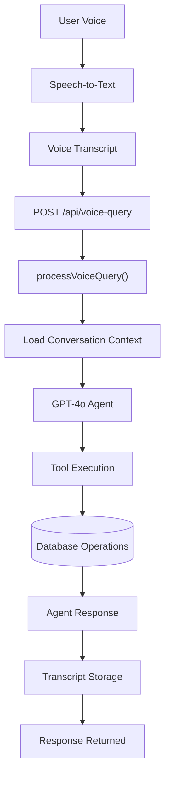

---

## Internal Processing

The route:

1. Creates a Supabase client
2. Parses the request body
3. Validates `userPrompt`
4. Calls `processVoiceQuery()`
5. Returns the AI response

Example request:

```json
{
  "userPrompt": "Show me all open work orders",
  "sessionId": "session-123"
}
```

Example response:

```json
{
  "success": true,
  "data": {
    "agentResponse": "...",
    "transcriptId": "...",
    "sessionId": "...",
    "toolsUsed": [...]
  }
}
```

---

# Inspection Creation Flow

## Endpoint

```text
POST /api/inspections/create
```

## Purpose

Creates inspection reports submitted by technicians.

Authentication:

```text
Required
```

Roles:

```text
TECHNICIAN only
```

---

## Flow

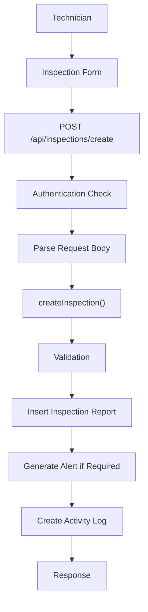

---

## Business Logic

The inspection service may:

* Create inspection records
* Classify severity
* Generate alerts
* Update dashboard metrics
* Create activity history

Example outcomes:
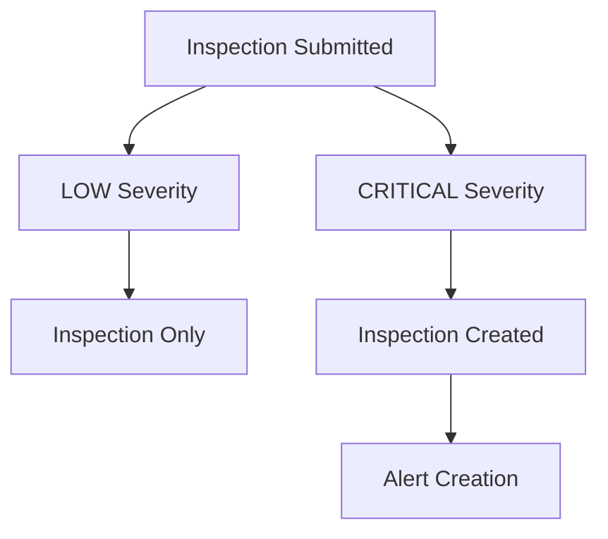

---

# Work Order Creation Flow

## Endpoint

```text
POST /api/work-orders/create
```

## Purpose

Creates maintenance work orders.

Authentication:

```text
Required
```

Roles:

```text
TECHNICIAN only
```

---

## Flow

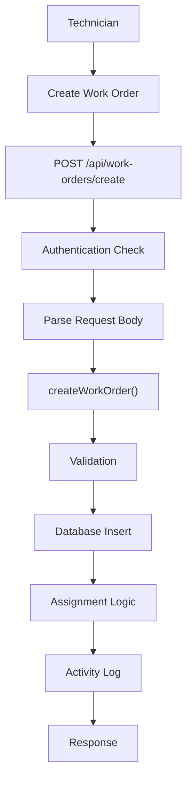

---

## Work Order Lifecycle

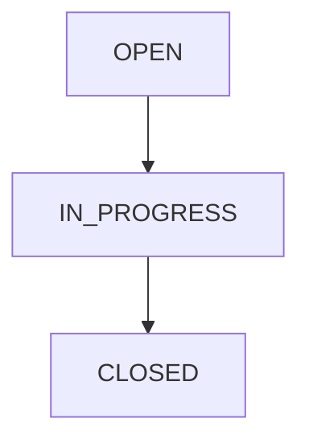

---

# Dashboard Data Flow

## Technician Dashboard

Endpoint:

```text
GET /api/dashboard/technician
```

Flow:

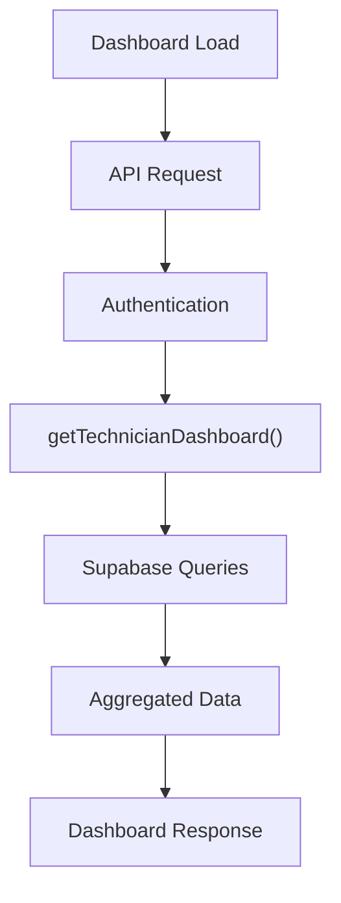

Returned data includes:

* Assigned work orders
* Inspection history
* Voice transcripts
* Activity logs
* Offline sync status

---

## Supervisor Dashboard

Endpoint:

```text
GET /api/dashboard/supervisor
```

Flow:

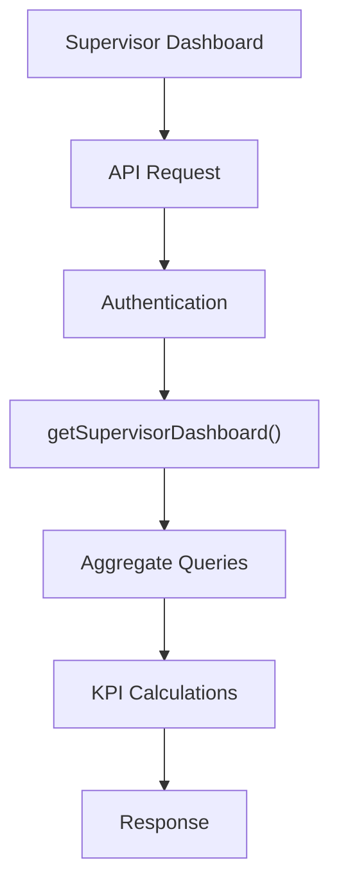

Returned data includes:

* KPI metrics
* Alerts
* Work orders
* Inspections
* Equipment data
* Technician activity
* Repair history

---

# Equipment History Flow

## Endpoint

```text
GET /api/equipment/[id]/history
```

Purpose:

Retrieve maintenance history for a specific equipment asset.

Flow:

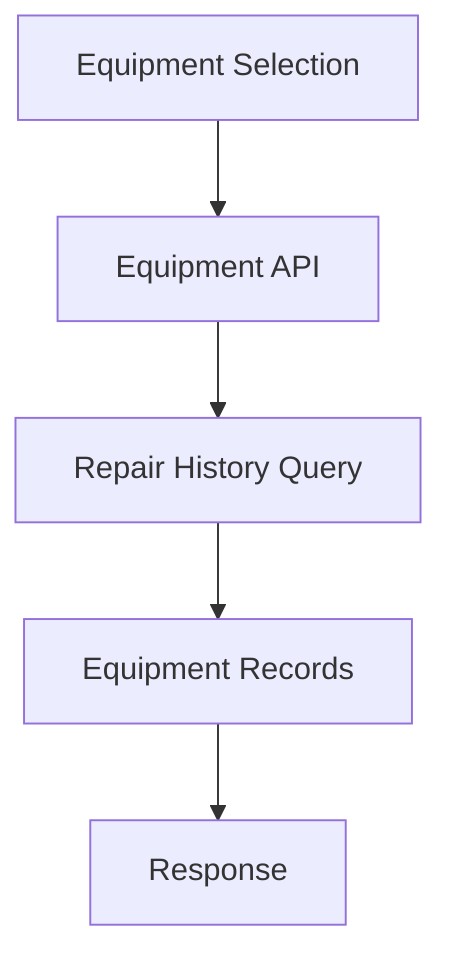

Returned data:

* Equipment details
* Historical repairs
* Failure records
* Maintenance information

---

# Speech-to-Text Flow

## Endpoint

```text
POST /api/stt
```

Purpose:

Convert recorded speech into text.

Flow:

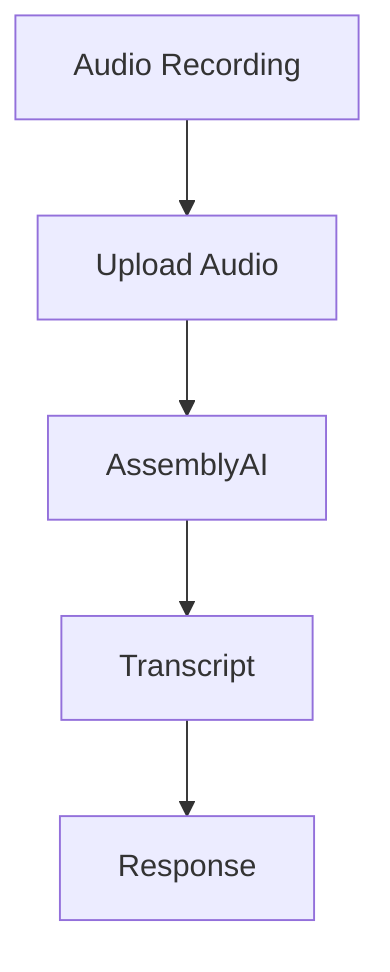

Output:

```json
{
  "text": "Create a work order for the HVAC unit"
}
```

---

# Text-to-Speech Flow

## Endpoint

```text
POST /api/tts
```

Purpose:

Convert AI-generated text responses into audio.

Flow:

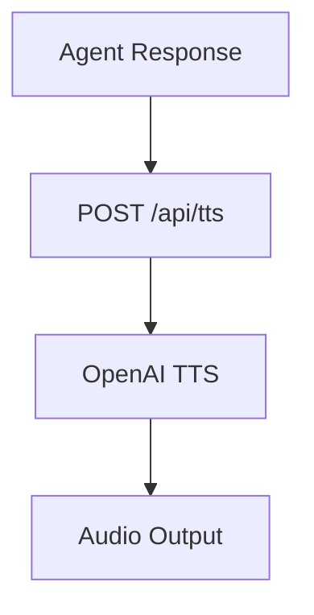

Output:

```text
Audio Stream
```

---

# Offline Synchronization Flow

## Endpoint

```text
POST /api/sync-offline-queue
```

Purpose:

Synchronize offline actions after connectivity is restored.

Flow:

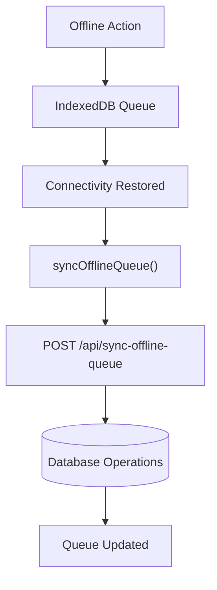

---

# Authentication Flow

Most protected endpoints use:

```text
withApiHandler()
```

with:

```text
auth: true
```

or:

```text
roles: ["TECHNICIAN"]
roles: ["SUPERVISOR"]
```

Flow:

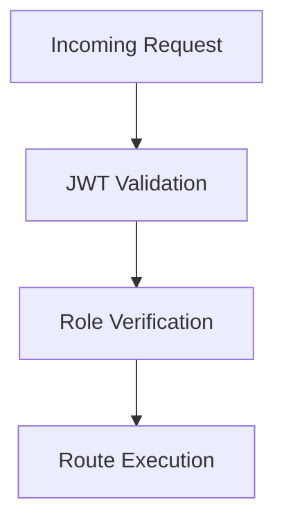

Unauthorized users receive an authentication error before business logic executes.

---

# Common API Pattern

Most routes follow this structure:

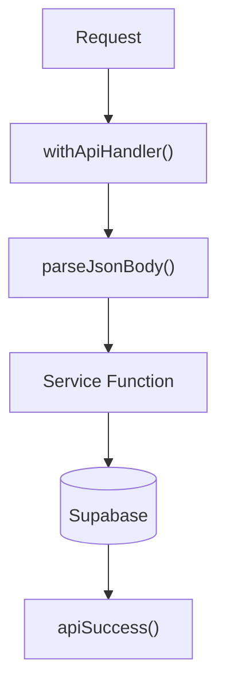

Benefits:

* Consistent error handling
* Reusable authentication
* Centralized validation
* Predictable responses
* Easier testing

---

# Design Principles

The VoxField API layer is designed around:

1. Thin route handlers
2. Service-layer business logic
3. Consistent authentication
4. Role-based authorization
5. Structured responses
6. AI-assisted workflows
7. Offline-first support
8. Scalable architecture