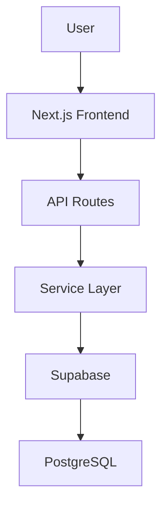
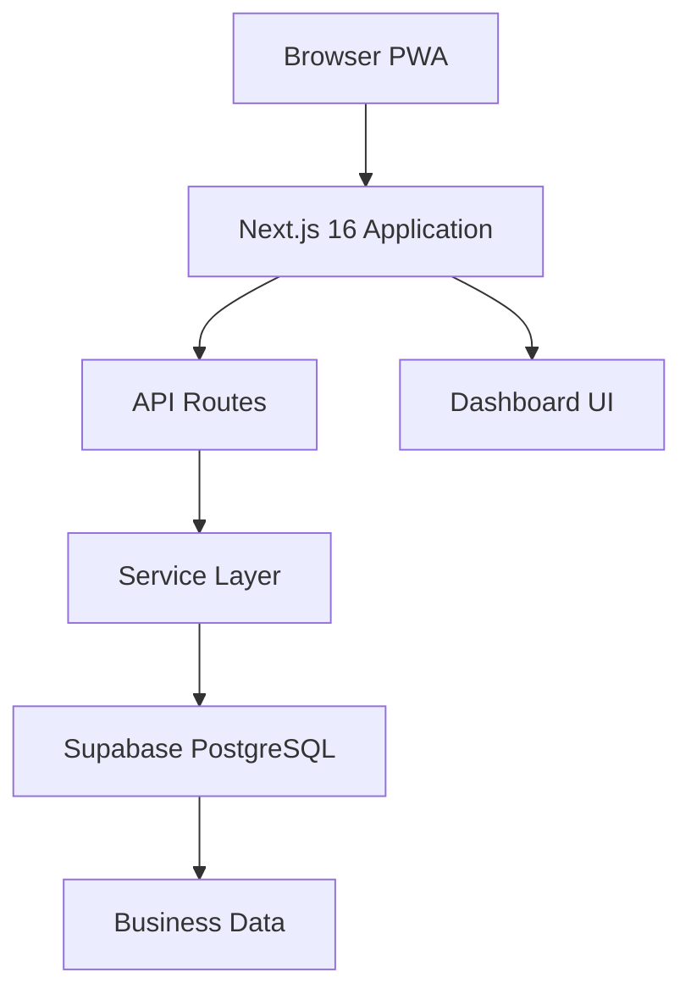
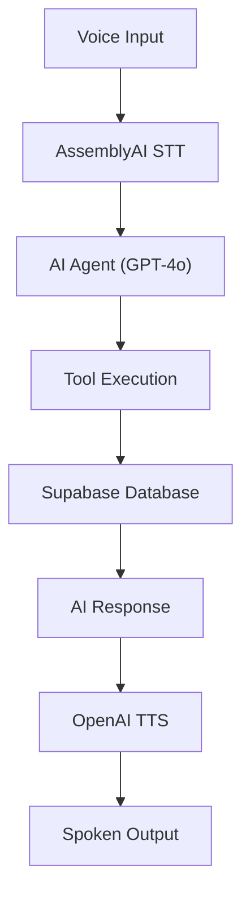
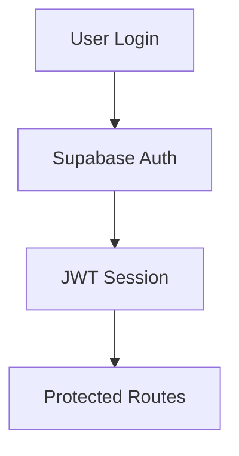
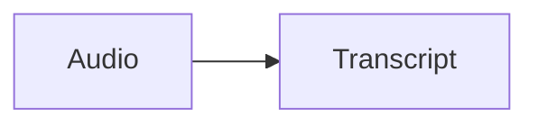
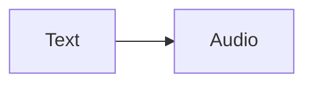
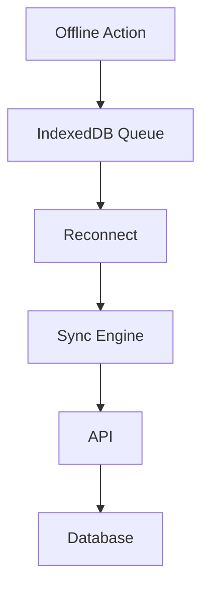

# VoxField Architecture

## Overview

VoxField is a voice-first field service operations platform designed for technicians and supervisors working in industrial environments.

The application enables users to interact with equipment records, inspections, work orders, and alerts through natural language voice commands while supporting offline operation through Progressive Web App (PWA) technologies.

The system follows a layered architecture:



---

## High-Level System Architecture



Voice interactions follow an extended flow:



---

## Frontend Architecture

The frontend is built using Next.js 16 App Router and TypeScript.

### Primary Responsibilities

* Authentication
* Dashboard rendering
* Voice interaction
* Offline support
* Queue management
* Supervisor monitoring
* Technician operations

### Major Frontend Components

#### Dashboard Components

Located in:

```
src/components/dashboard/
```

Responsibilities:

* KPI cards
* Work order management
* Alert monitoring
* Activity feeds
* Inspection lists
* Transcript monitoring

#### Voice Components

Located in:

```
src/components/voice/
```

Responsibilities:

* Microphone recording
* Voice visualization
* Service Worker registration
* Voice pipeline integration

#### Layout Components

Located in:

```
src/components/layout/
```

Responsibilities:

* Sidebar navigation
* Header actions
* Role-based navigation
* Application shell

---

## Backend Architecture

The backend is implemented using Next.js API Routes.

### API Layer

Located in:

```
src/app/api/
```

Responsibilities:

* Authentication validation
* Request handling
* Input validation
* Agent execution
* Database operations

Examples:

```
/api/stt
/api/tts
/api/voice-query
/api/work-orders
/api/inspections
/api/dashboard
```

---

## Service Layer

The service layer contains business logic and data orchestration.

Location:

```
src/services/
```

Primary service:

```
operations.service.ts
```

Responsibilities:

* Work order management
* Inspection processing
* Dashboard aggregation
* Alert generation
* Business rule enforcement

Benefits:

* Keeps API routes thin
* Centralizes business logic
* Improves testability

---

## Database Layer

The database is hosted in Supabase PostgreSQL.

Major entities include:

* Users
* Equipment
* Repair History
* Inspection Reports
* Work Orders
* Alerts
* Transcripts
* Activity Logs

Authentication is handled using Supabase Auth with role-based access control.

Row Level Security (RLS) is used to enforce data access rules.

---

## Authentication Architecture

Authentication flow:



Two user roles exist:

### Technician

Permissions:

* Create inspections
* Create work orders
* Update assigned work orders
* Query operational data

### Supervisor

Permissions:

* Access all records
* View KPIs
* Acknowledge alerts
* Resolve alerts
* Monitor activity

---

## Voice Processing Architecture

Voice interactions are processed using a multi-stage pipeline.

### Stage 1: Capture

The user records speech through the browser microphone.

### Stage 2: Speech-to-Text

Audio is sent to AssemblyAI.

Output:



### Stage 3: Agent Processing

The transcript is sent to GPT-4o.

The AI agent:

* Determines user intent
* Selects tools
* Executes operations
* Generates responses

### Stage 4: Text-to-Speech

The final response is synthesized using OpenAI TTS.

Output:



---

## Offline Architecture

VoxField supports offline operation using Progressive Web App technologies.

Core components:

### Service Worker

Responsibilities:

* Asset caching
* Offline navigation
* Runtime caching

### IndexedDB

Stores:

* Offline queue
* Voice recordings
* Sync metadata
* Cached data

### Sync Engine

Responsibilities:

* Connectivity monitoring
* Queue processing
* Automatic synchronization

Flow:



---

## Project Structure

```
src/
├── app/
│   ├── api/
│   ├── (auth)/
│   ├── (dashboard)/
│   └── (protected)/
│
├── components/
│   ├── dashboard/
│   ├── voice/
│   ├── layout/
│   └── ui/
│   └── auth/
│   └── marketing/
│
├── services/
│
├── lib/
│   ├── agent.ts
│   ├── agent-tools.ts
│   ├── sync.ts
│   ├── indexeddb.ts
│   └── supabase/
│
├── hooks/
├── context/
└── types/
```

---

## Design Principles

VoxField is built around the following principles:

1. Voice-first interaction
2. Offline-first reliability
3. Role-based security
4. Service-oriented architecture
5. AI-assisted workflows
6. Mobile-first field operations
7. Progressive enhancement through PWA capabilities