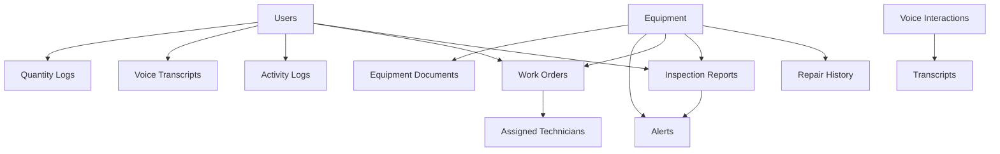
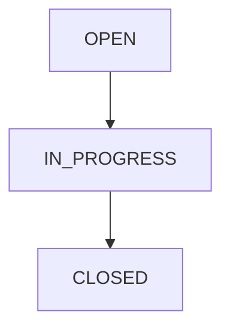
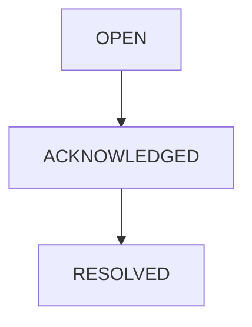

# VoxField Database Schema

## Overview

VoxField uses Supabase PostgreSQL as its primary database. The schema is designed to support field service operations, voice interactions, inspections, work orders, alerts, and offline synchronization.

The database follows a relational structure with role-based access control enforced through Supabase Authentication and Row Level Security (RLS).

---

# Entity Relationship Overview



---

# Users

Stores all authenticated users of the system.

## Table: users

| Field         | Type      | Description              |
| ------------- | --------- | ------------------------ |
| id            | UUID      | Primary key              |
| employee_code | String    | Employee identifier      |
| full_name     | String    | User full name           |
| email         | String    | Login email               |
| role          | UserRole  | TECHNICIAN or SUPERVISOR |
| created_at    | Timestamp | Record creation time     |
| updated_at    | Timestamp | Last modification time   |

## Relationships

A user can:

* Create inspections
* Create work orders
* Be assigned work orders
* Generate transcripts
* Generate activity logs
* Create quantity logs

---

# Equipment

Stores all physical equipment being monitored.

## Table: equipment

| Field             | Type            | Description                 |
| ----------------- | --------------- | ---------------------------- |
| id                | UUID            | Primary key                 |
| equipment_code    | String          | Unique equipment identifier |
| name              | String          | Equipment name               |
| location          | String          | Physical location            |
| manufacturer      | String          | Equipment manufacturer       |
| installation_date | Date            | Installation date            |
| status            | EquipmentStatus | Current equipment status     |
| created_at        | Timestamp       | Creation timestamp           |
| updated_at        | Timestamp       | Update timestamp             |

## Relationships

Equipment may have:

* Repair history records
* Inspection reports
* Work orders
* Alerts
* Technical documents

---

# Repair History

Tracks historical maintenance and repair operations.

## Table: repair_history

| Field                 | Type      | Description            |
| --------------------- | --------- | ----------------------- |
| id                    | UUID      | Primary key             |
| equipment_id          | UUID      | Equipment reference     |
| repair_date           | Date      | Repair date             |
| failure_type          | String    | Failure classification  |
| description           | String    | Repair details          |
| performed_by          | String    | Technician name         |
| repair_duration_hours | Number    | Duration of repair      |
| cost                  | Number    | Repair cost             |
| created_at            | Timestamp | Creation timestamp      |
| updated_at            | Timestamp | Update timestamp        |

---

# Inspection Reports

Stores technician inspection submissions.

## Table: inspection_reports

| Field          | Type               | Description                  |
| -------------- | ------------------ | ----------------------------- |
| id             | UUID               | Primary key                  |
| equipment_id   | UUID               | Equipment reference          |
| technician_id  | UUID               | Technician reference         |
| title          | String             | Inspection title             |
| description    | String             | Inspection findings          |
| recommendation | String             | Suggested actions            |
| severity       | InspectionSeverity | LOW, MEDIUM, HIGH, CRITICAL  |
| status         | InspectionStatus   | OPEN, REVIEWED, CLOSED       |
| created_at     | Timestamp           | Creation timestamp           |
| updated_at     | Timestamp           | Update timestamp             |

## Relationships

Inspection reports:

* Belong to equipment
* Are created by technicians
* Can generate alerts

---

# Work Orders

Tracks maintenance and repair tasks.

## Table: work_orders

| Field             | Type              | Description                   |
| ----------------- | ----------------- | ------------------------------ |
| id                | UUID              | Primary key                   |
| work_order_number | String            | Human-readable work order ID  |
| equipment_id      | UUID              | Equipment reference           |
| created_by        | UUID              | User who created the order    |
| assigned_to       | UUID              | Assigned technician           |
| title             | String            | Work order title              |
| description       | String            | Work order details            |
| priority          | WorkOrderPriority | LOW, MEDIUM, HIGH, CRITICAL   |
| status            | WorkOrderStatus   | OPEN, IN_PROGRESS, CLOSED     |
| completed_at      | Timestamp         | Completion time               |
| created_at        | Timestamp         | Creation timestamp            |
| updated_at        | Timestamp         | Update timestamp              |

## Workflow



---

# Alerts

Stores operational alerts generated by inspections and system activity.

## Table: alerts

| Field                | Type          | Description                   |
| -------------------- | ------------- | ------------------------------ |
| id                   | UUID          | Primary key                   |
| equipment_id         | UUID          | Equipment reference           |
| inspection_report_id | UUID          | Related inspection            |
| severity             | AlertSeverity | HIGH or CRITICAL              |
| message              | String        | Alert description             |
| status               | AlertStatus   | OPEN, ACKNOWLEDGED, RESOLVED  |
| acknowledged_by      | UUID          | Supervisor who acknowledged   |
| resolved_at          | Timestamp     | Resolution time               |
| created_at           | Timestamp     | Creation timestamp            |
| updated_at           | Timestamp     | Update timestamp              |

## Workflow



---

# Voice Transcripts

Stores all AI-agent conversations.

## Table: transcripts

| Field          | Type      | Description              |
| -------------- | --------- | -------------------------- |
| id             | UUID      | Primary key               |
| user_id        | UUID      | User reference            |
| user_prompt    | String    | User request              |
| agent_response | String    | AI response                |
| session_id     | String    | Conversation session      |
| tools_used     | Array     | Tools invoked              |
| is_offline     | Boolean   | Offline submission flag   |
| captured_at    | Timestamp | Voice capture time         |
| synced_at      | Timestamp | Sync completion time       |
| queue_duration | Number    | Offline queue duration     |
| created_at     | Timestamp | Creation timestamp         |
| updated_at     | Timestamp | Update timestamp           |

## Purpose

Used for:

* Audit trails
* Conversation history
* Session continuity
* Analytics

---

# Activity Logs

Tracks important operational events.

## Table: activity_logs

| Field       | Type      | Description                 |
| ----------- | --------- | ----------------------------- |
| id          | UUID      | Primary key                 |
| user_id     | UUID      | User reference               |
| action_type | String    | Action performed             |
| entity_type | String    | Entity category              |
| entity_id   | UUID      | Entity identifier            |
| description | String    | Human-readable description   |
| created_at  | Timestamp | Event time                   |
| updated_at  | Timestamp | Update time                  |

Examples:

* Inspection created
* Work order updated
* Alert acknowledged
* Work order completed

---

# Equipment Documents

Stores documentation associated with equipment.

## Table: equipment_documents

| Field         | Type      | Description                  |
| ------------- | --------- | ------------------------------ |
| id            | UUID      | Primary key                  |
| equipment_id  | UUID      | Equipment reference          |
| document_name | String    | Document title                |
| document_type | String    | File category                 |
| document_text | String    | Extracted document content    |
| created_at    | Timestamp | Creation timestamp            |
| updated_at    | Timestamp | Update timestamp              |

Future AI-powered document search and RAG functionality will operate on this table.

---

# Quantity Logs

Tracks inventory and quantity changes.

## Table: quantity_logs

| Field             | Type      | Description        |
| ----------------- | --------- | --------------------- |
| id                | UUID      | Primary key         |
| asset_item        | String    | Asset name           |
| previous_quantity | Number    | Previous quantity    |
| updated_quantity  | Number    | Updated quantity     |
| user_id           | UUID      | User reference       |
| timestamp         | Timestamp | Change time          |
| source_action     | String    | Triggering action    |

---

# Error Logs

Stores system and operational errors.

## Table: error_logs

| Field             | Type      | Description             |
| ----------------- | --------- | -------------------------- |
| id                | UUID      | Primary key             |
| error_type        | String    | Error category          |
| error_message     | String    | Detailed error message  |
| component_service | String    | Source component        |
| timestamp         | Timestamp | Error occurrence time   |
| severity          | String    | Error severity level    |

Used for debugging, monitoring, and operational auditing.

---

# Enumerations

## UserRole

```text
TECHNICIAN
SUPERVISOR
```

---

## EquipmentStatus

```text
ACTIVE
UNDER_MAINTENANCE
RETIRED
```

---

## InspectionSeverity

```text
LOW
MEDIUM
HIGH
CRITICAL
```

---

## InspectionStatus

```text
OPEN
REVIEWED
CLOSED
```

---

## WorkOrderPriority

```text
LOW
MEDIUM
HIGH
CRITICAL
```

---

## WorkOrderStatus

```text
OPEN
IN_PROGRESS
CLOSED
```

---

## AlertSeverity

```text
HIGH
CRITICAL
```

---

## AlertStatus

```text
OPEN
ACKNOWLEDGED
RESOLVED
```

---

# Security Model

Authentication is handled through Supabase Auth.

Authorization is enforced using:

* JWT-based sessions
* Role-based permissions
* PostgreSQL Row Level Security (RLS)

Roles supported:

### Technician

* Create inspections
* Create work orders
* Update assigned work orders
* View operational records

### Supervisor

* Access all operational data
* View KPIs
* Acknowledge alerts
* Resolve alerts
* Monitor technician activity

---

# Future Schema Extensions

Potential future additions include:

* Notification system
* Mobile push notification records
* AI interaction analytics
* Equipment document embeddings
* Predictive maintenance records
* Real-time event streams